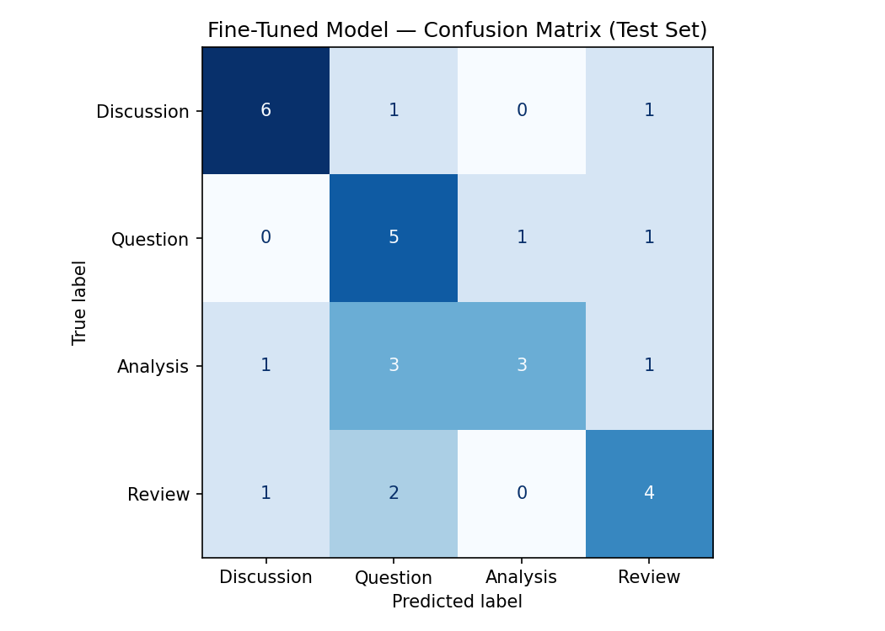

# AI201 Project 3

## Overview

This project fine-tunes **DistilBERT (`distilbert-base-uncased`)** to classify posts from **r/LetsTalkMusic** into one of four categories:

- **Review** – Evaluates or critiques an artist, album, song, or other musical work.
- **Discussion** – Shares personal opinions or experiences to encourage conversation.
- **Question** – Primarily asks the community for information, explanations, or opinions.
- **Analysis** – Examines broader musical topics using reasoning, comparisons, or historical/contextual evidence.

The goal is to determine whether fine-tuning a transformer model can outperform a prompt-based baseline on this music discussion classification task.

---

# Dataset

- **Community:** r/LetsTalkMusic
- **Dataset Size:** 200 labeled Reddit posts
- **Labels:** 4
  - Review
  - Discussion
  - Question
  - Analysis
- **Train / Validation / Test Split:** 70% / 15% / 15%

---

# Models

## Baseline Model

The baseline model uses prompt-based classification without task-specific fine-tuning.

### Baseline Accuracy

**Accuracy:** **0.500**

### Baseline Metrics

| Label | Precision | Recall | F1-score |
|--------|----------:|--------:|---------:|
| Discussion | 0.35 | 0.88 | 0.50 |
| Question | 1.00 | 0.57 | 0.73 |
| Analysis | 0.00 | 0.00 | 0.00 |
| Review | 0.67 | 0.57 | 0.62 |

**Macro F1:** 0.46

---

## Fine-Tuned DistilBERT

The fine-tuned model was trained using:

- Model: `distilbert-base-uncased`
- Epochs: 3
- Learning Rate: 2e-5
- Batch Size: 16

### Fine-Tuned Accuracy

**Accuracy:** **0.600**

### Fine-Tuned Metrics

| Label | Precision | Recall | F1-score |
|--------|----------:|--------:|---------:|
| Discussion | 0.75 | 0.75 | 0.75 |
| Question | 0.45 | 0.71 | 0.56 |
| Analysis | 0.75 | 0.38 | 0.50 |
| Review | 0.57 | 0.57 | 0.57 |

**Macro F1:** 0.59

---

# Model Comparison

| Metric | Baseline | Fine-Tuned |
|--------|----------:|-----------:|
| Accuracy | **0.50** | **0.60** |
| Macro F1 | 0.47 | **0.59** |

The fine-tuned model improved overall accuracy by **10 percentage points** and significantly increased the macro F1 score, indicating better performance across all four classes.

---

# Confusion Matrix

---

# Error Analysis

The fine-tuned model made **12 incorrect predictions out of 30 test examples**.

## Error 1 – Discussion → Review

**Post**

> "All Things Must Pass takes you on the journey of a child who is growing up..."

**True Label:** Discussion

**Predicted:** Review (0.70)

**Analysis**

Although the author mainly shares a personal interpretation to start a discussion, the detailed description of the album resembles a traditional album review. The model relied on review-like language rather than the author's conversational intent.

---

## Error 2 – Analysis → Question

**Post**

> "What is it about music that makes it impact us more than any other medium?"

**True Label:** Analysis

**Predicted:** Question (0.49)

**Analysis**

This post opens with a question, but the author develops a philosophical argument throughout the remainder of the post. The model focused on the interrogative wording instead of recognizing the deeper analytical reasoning.

---

## Error 3 – Question → Review

**Post**

> "Explain the appeal of Sleep Token to me."

**True Label:** Question

**Predicted:** Review (0.55)

**Analysis**

The model interpreted the discussion of Sleep Token's popularity as a review because of the evaluative language. However, the author's primary goal is to ask the community for explanations rather than critique the band.

---

# Common Error Patterns

After reviewing the incorrect predictions, several trends emerged.

### 1. Question Bias

Posts beginning with a question were frequently classified as **Question**, even when the remainder of the post contained extended analysis or discussion.

### 2. Analysis Was the Hardest Class

Analysis posts often resemble discussions because they include personal opinions while also presenting arguments. The model frequently confused Analysis with both Question and Discussion.

### 3. Review Detection

The model sometimes labeled detailed personal opinions as Reviews even when the author's intent was simply to start a discussion.

---

# Sample Classifications

| Example | Predicted Label | Confidence | Notes |
|----------|----------------|-----------:|------|
| "I finally listened to Mutiny After Midnight by Johnny Blue Skies (Sturgill Simpson)..." | Review | 0.83 | Correct - The post primarily evaluates an album by discussing its strengths, weaknesses, and the author's overall opinion. This aligns closely with the definition of a Review. |
| "Explain the appeal of Sleep Token to me." | Review | 0.55 | Incorrect – asks for explanations despite containing evaluative language. |
| "All Things Must Pass..." | Review | 0.70 | Incorrect – resembles a review but primarily starts a discussion. |

---

# Reflection

The fine-tuned model successfully learned many of the language patterns associated with each label and clearly outperformed the baseline. It performed especially well on **Discussion**, achieving the highest F1-score of **0.75**.

However, the model still relied heavily on surface-level cues such as question marks and evaluative language instead of consistently identifying the author's intent. This was most noticeable for **Analysis**, where posts often begin with questions but are actually long-form arguments. Collecting more examples of these edge cases would likely improve the model's ability to distinguish between Question and Analysis.

---

# Spec Reflection

### How the Spec Helped

Creating label definitions and documenting hard edge cases before collecting data made the annotation process much more consistent. The predefined rules helped reduce ambiguity when labeling similar posts.

### How the Implementation Differed

During annotation, I found that many posts naturally combined multiple discourse styles. Rather than labeling based solely on the title or opening sentence, I classified posts according to their primary purpose, resulting in more consistent annotations than originally anticipated.

---

# AI Usage

## Label Stress Testing

I used ChatGPT to generate boundary-case Reddit posts between my labels before annotation. This helped refine the definitions for **Discussion** and **Question**, which initially overlapped.

## Failure Analysis

After evaluating the fine-tuned model, I provided several incorrect predictions to ChatGPT to identify common error patterns. I verified these patterns manually before including them in this report.